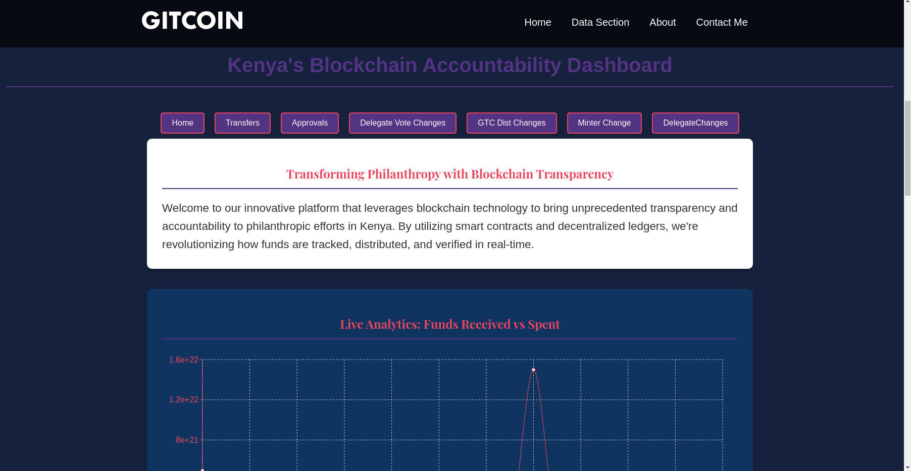

# Gitcoin Tracker
## Live Link
https://gitcointracker.netlify.app/

## Description

My Web App is a React-based application designed to provide users with real-time data on Gitcoin philanthropy tracking, NFT contributions, or decentralized finance (DeFi) activity. The application offers a user-friendly interface for tracking and analyzing blockchain-based transactions, with live data visualization and filtering options. This ensures transparency, accountability, and seamless interactions with decentralized protocols.

## Key features include:

- Real-time tracking of transfers, approvals, and other on-chain events.
- Interactive dashboards with data filtering and visualization.
- Integration with decentralized platforms like Gitcoin for contributions and NFT purchases.

## Table of Contents

- Installation
- Usage
- Features
- Contributing
- Roadmap
- Support
- License
- Contact

## Installation

To set up the project locally, follow the steps below:

### Clone the repository:

```bash
git clone https://github.com/Ephymuiruri/blockchain-tracker
```

### Navigate to the project directory:

```bash
cd blockchain-tracker
```

### Install dependencies:

```bash
npm install
```

### Start the development server:

```bash
npm start
```

The app will now run on http://localhost:3000.

## Usage

### Basic Navigation:
Once the app is running, you'll see the homepage with a sticky navigation bar that lets you move between sections (e.g., Home, Data Section, About, Contact).

about
## Interacting with Data:
 In the "Data Section", users can filter transfers, approvals, and GTC distribution data. The dashboard updates in real-time, pulling live data from The Graph using Apollo Client.
 ### Data SEction
 
 ### Transfers Section
 
 ### Approvals Section
 

## Analytics Dashboard:
 The analytics section provides real-time charts powered by Recharts, offering insight into transaction trends over time. Users can hover over the charts for more detailed breakdowns.
 

## To build the app for production:

```bash
npm run build
```

## To deploy on Netlify:

Ensure that you’ve connected your GitHub repository to Netlify.

Run `npm run build` to create a production build.

Push your changes to GitHub.

Netlify will automatically detect changes and deploy the app.

## Features

- Blockchain Data Tracking: Monitor transfers, approvals, and other on-chain events in real-time.
- Live Analytics: Visualize transaction data using charts and graphs.
- Gitcoin Integration: View and contribute to Gitcoin projects.
- NFT Marketplace: Purchase NFTs directly from within the app.
- User Authentication: Secure login and wallet connection using MetaMask.
- Responsive Design: Fully optimized for desktop, tablet, and mobile devices.

## Contributing

Contributions are welcome! To contribute, please follow these steps:

### Fork the repository

### Create a new branch:

```bash
git checkout -b feature/AmazingFeature
```

### Commit your changes:

```bash
git commit -m 'Add some AmazingFeature'
```

### Push to the branch:

```bash
git push origin feature/AmazingFeature
```

### Open a Pull Request

Be sure to include detailed explanations of any changes and link any relevant issues.

## Roadmap

Future features and enhancements:

- Add a feature to track donations made through the app in real time.
- Support for additional blockchain networks like Polygon and Binance Smart Chain.
- Advanced filtering and sorting for transaction data.
- Mobile app version with full-feature parity.
- Multi-language support.

## Support

For any issues or questions, feel free to open an issue on GitHub or contact the maintainers:

- GitHub Issues: https://github.com/yourusername/your-repo-name/issues
- Email: email@example.com

## License

This project is licensed under the MIT License. Feel free to use and modify the code in any way, but please give proper attribution.

## Contact

Ephy Muiruri Wachira - https://github.com/Ephymuiruri

## Project Link

https://github.com/Ephymuiruri/blockchain-tracker

## Live Link
https://gitcointracker.netlify.app/
